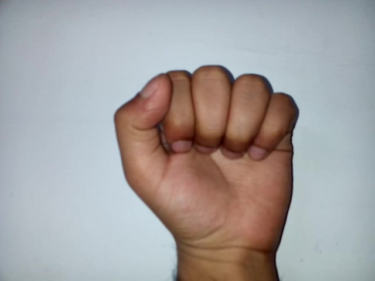

# Reim-Assistant

## Installing

1. Download the newest version of program.
2. Open installer.
3. Install

## Opportunities

This program executes your commands.
You can create voice commands.
Function 'VISUAL CONTROL' can move cursor.
To use VISUAL CONTROL you should show the web-camera a fist.
Example of fist:

